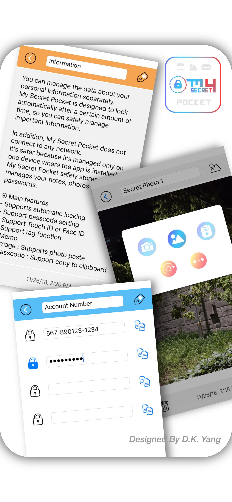
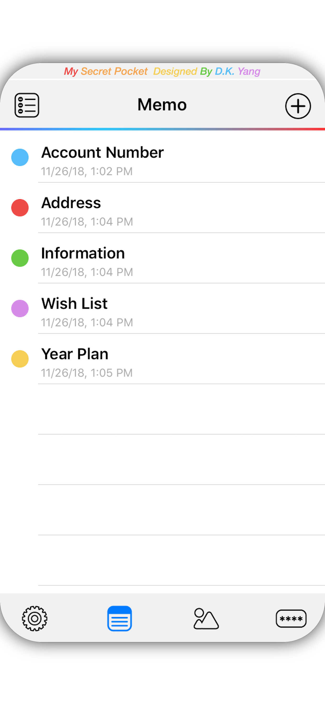
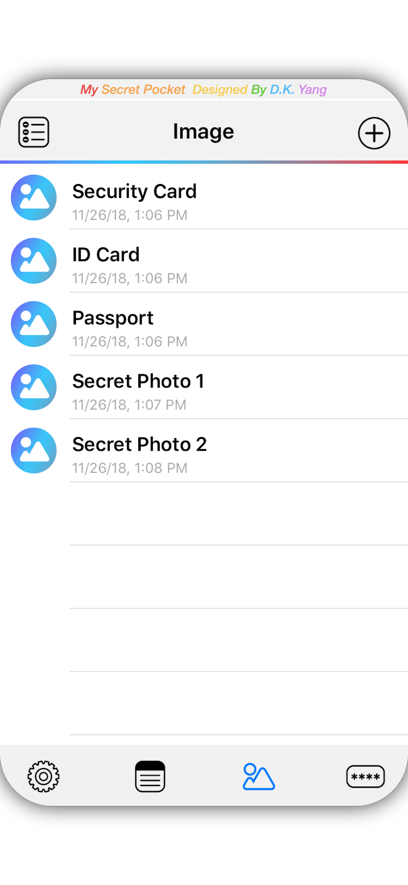
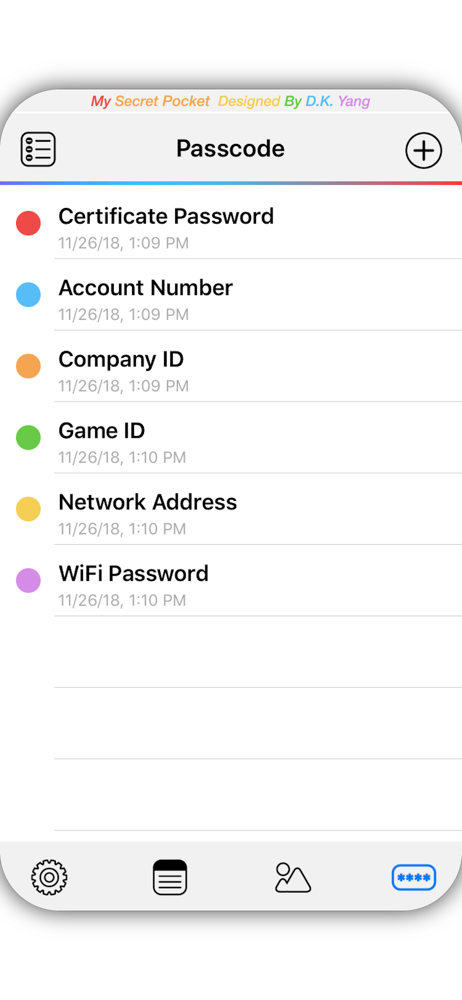

# MySecretS

> **Author:** DONGKOOK YANG ([@dk7998](https://github.com/dk7998))  
> **Project:** MySecretS (iOS Swift App)  
> **Last Update:** 2025.07

---

## 📱 App Screenshots

<table>
  <tr>
    <td></td>
    <td></td>
    <td></td>
    <td></td>
  </tr>
</table>

---

## 📱 About

**MySecretS**는 메모, 이미지, 패스코드 등 민감한 정보를 안전하게 저장·관리할 수 있는 iOS 앱입니다.  
UIKit 기반 MVVM 아키텍처, Core Data, 다양한 커스텀 UI 컴포넌트, 편리한 UX와 보안을 모두 고려해 개발되었습니다.

> 본 프로젝트는 기존 [Objective-C 기반 앱(MVC 구조)](https://apps.apple.com/kr/app/my-secret-pocket/id1443026468)을  
> **Swift + MVVM 아키텍처로 완전히 리팩토링**한 최신 버전입니다.  
>
> - **기존 앱:** [My Secret Pocket (App Store)](https://apps.apple.com/kr/app/my-secret-pocket/id1443026468)
> - **특징:** 실제 앱스토어에 출시되어 서비스된 Objective-C 원본 프로젝트를  
>   최신 Swift 코드와 MVVM 구조로 전면 개선  
>
> Swift 버전 소스코드는 모던 Swift 문법, 구조적 개선, 상용 배포 수준의 품질을 목표로 작성되었습니다.

---

## 🏗️ 프로젝트 폴더/파일 구조
```
MySecretS/
│
├── App/
│   ├── AppDelegate.swift
│   ├── SceneDelegate.swift
│   ├── CustomNavigationController.swift
│   └── AppSettings.swift
│
├── ViewControllers/
│   ├── MainViewController.swift
│   ├── SubController.swift
│   ├── SubController2.swift
│   ├── SubController3.swift
│   ├── SetController.swift
│   └── LockViewController.swift
│
├── ViewModels/
│   ├── MainViewModel.swift
│   ├── SubViewModel.swift
│   ├── SubViewModel2.swift
│   └── SubViewModel3.swift
│
├── CustomViews/
│   ├── ImageScrollView.swift
│   └── PassCodeView.swift
│
├── Utils/
│   ├── Utils.swift
│   └── PrivacyCoverManager.swift
│
└── README.md
```
---

## 🔑 앱 주요 구조 및 역할

- **AppDelegate.swift / SceneDelegate.swift**  
  - 앱 런칭, CoreData 스택 초기화, 앱 전역 환경 관리
  - 버전별 분기처리로 iOS 12~최신까지 완벽 호환 

- **AppSettings.swift**  
  - UserDefaults 키, 앱 전역 상수/설정 저장소 (다국어, 정렬옵션 등)

- **MainViewController / MainViewModel**
  - 메인 탭, 리스트, 항목 선택/전환/삭제/네비게이션 처리
  - MVVM 구조 적용. 데이터 fetch/삭제/상태 관리

- **SubController / SubViewModel**
  - 메모(Information) 상세 입력/수정/태그/날짜/삭제/초기화
  - 텍스트필드, 텍스트뷰, 태그뷰 커스텀 UI
  - 실시간 저장, 자동삭제(빈 항목), 키보드 예외 처리

- **SubController2 / SubViewModel2**
  - 사진(Photos) 상세 보기/편집/추가/삭제/붙여넣기/회전/반전
  - 이미지 피커, 커스텀 셀, 컬렉션뷰, 이미지 캐싱

- **SubController3 / SubViewModel3**
  - 패스코드(Passcode) 입력/수정/잠금옵션/복사/초기화/삭제
  - 필드별 비밀번호, 각 필드별 보안 설정, 클립보드 복사 등

- **CustomNavigationController**
  - 커스텀 네비게이션 (Pop 제스처 감지, 사용자 액션 추적)

- **LockViewController**
  - 앱 락/비밀번호 입력/앱 진입 제한 기능 구현
  
- **PassCodeView.swift**
  - 패스코드 입력 커스텀 UI
  
- **ImageScrollView**
  - 사진 상세보기용 커스텀 UIScrollView (Pinch, Pan 지원)

- **SetController**
  - 앱 환경설정(언어/정렬/보안 등) 전용 뷰컨트롤러

- **PrivacyCoverManager**
  - 앱 포그라운드/백그라운드 전환 시 프라이버시 커버 처리

- **Utils.swift**
  - RGB 변환, 날짜 포맷팅, 기타 헬퍼 함수

---

## ⚙️ 기술 스택

- **Language:** Swift 5.8+
- **Framework:** UIKit, CoreData, Foundation
- **Architecture:** MVVM + Delegate
- **Target:** iOS 15.0+
- **UI:** XIB 기반 커스텀 뷰/컨트롤, Dynamic Type 일부 지원
- **Localization:** 다국어 번역 지원 (영/한/일/중)

---

## 🚀 실행/빌드 방법

1. **Xcode 14 이상에서 열기**
2. 시뮬레이터 또는 실기기(iOS 15+)에서 Build & Run  
3. CoreData/앱 설정 자동 적용 (추가 Dependency 없음)

---

## 🗂️ 폴더/파일 선택 기준

> 본 저장소는 실무 예제 및 iOS 아키텍처 학습, 코드 리뷰/공유 목적으로  
> **필수 Swift 파일만 공개**합니다. (스토리보드/리소스/테스트코드/3rd파티 제외)

- 실제 프로젝트는 이외 리소스, XIB, .xcdatamodeld 파일, Asset 등 별도 포함 필요

---

## ℹ️ 기타

- **문의:** [GitHub 프로필](https://github.com/dk7998) 또는 Issue 등록
- **저작권:** 본 프로젝트 코드는 DONGKOOK YANG(양동국)에게 있으며,  
  무단 복제 및 상업적 사용을 금지합니다.

---
